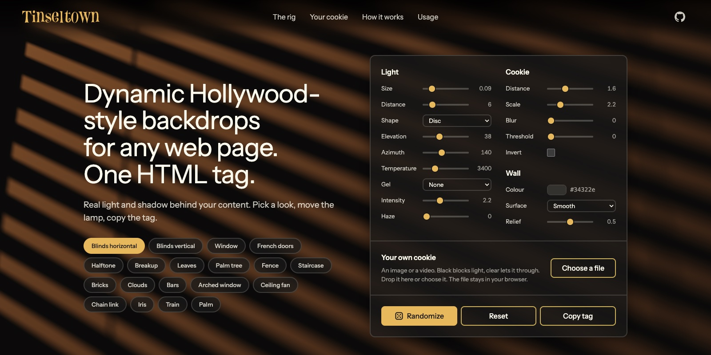
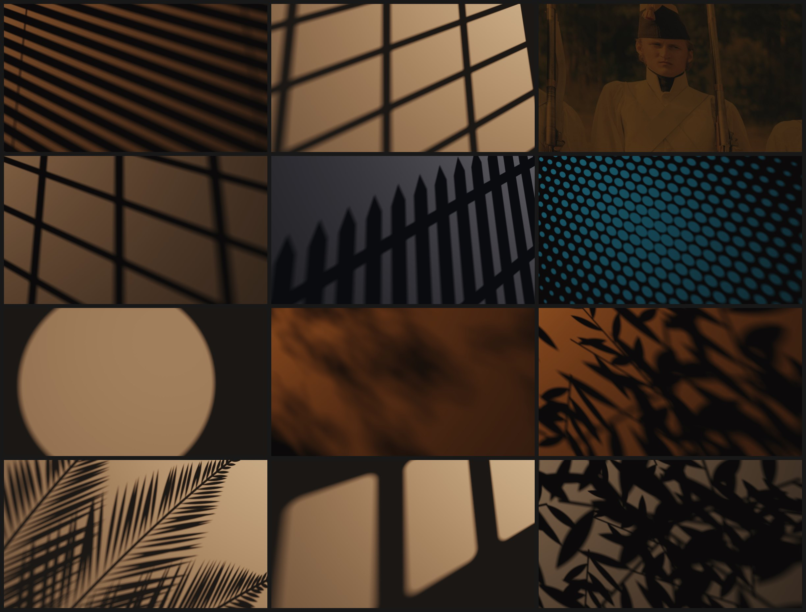

# tinseltown

Dynamic Hollywood-style backdrops for any web page. One HTML tag.

[](https://www.npmjs.com/package/tinseltown)
[](https://www.npmjs.com/package/tinseltown)
[](LICENSE)

**[Live demo](https://thevangelist.github.io/tinseltown/)**

The web fakes window light with blurred PNGs and looped videos. Tinseltown builds the rig instead: a lamp, a cookie
and a wall, traced on the GPU for every pixel. A cookie, short for cucoloris, is the cut-out a grip puts in front of a
lamp. No dependencies, no build step.

## Install

Without installing anything:

```html
<script type="module" src="https://cdn.jsdelivr.net/npm/tinseltown@latest/src/tinseltown.js"></script>
```

With a bundler:

```sh
npm install tinseltown@latest
```

```js
import 'tinseltown'
```

The presets and the option schema are exported too, as `tinseltown/cookies` and `tinseltown/options`.

## Usage

The element fills its nearest positioned parent and sits behind the content.

```html
<section style="position: relative; isolation: isolate">
  <tinseltown-backdrop preset="blinds-horizontal"></tinseltown-backdrop>
  <h1>Your content</h1>
</section>
```

A full-page backdrop, late afternoon, with smoke in the room:

```html
<tinseltown-backdrop preset="window" style="position: fixed"
  elevation="25" color-temp="2800" haze="0.4"></tinseltown-backdrop>
```

Leaves that move:

```html
<tinseltown-backdrop preset="leaves" motion="sway breathe"></tinseltown-backdrop>
```

Presets: `blinds-horizontal` `blinds-vertical` `window` `french-doors` `arched-window` `bars` `chain-link` `fence`
`staircase` `bricks` `halftone` `breakup` `iris` `clouds` `leaves` `palm` `palm-tree` `ceiling-fan` `train`

Every preset is generated in code. The repo ships no third-party artwork.

## Your own cookie

A cookie is any image, video or canvas. Black blocks light. Transparent or white passes it. Grey passes part of it.
Black on transparent and white on black both work as they are. Colour tints the light, the way a gel or a slide does,
so a photo works as a cookie too. A photo repeats mirrored, which hides the seam.

```html
<tinseltown-backdrop src="cookie.png"></tinseltown-backdrop>
```

A phone photo of a cut-out is noisy. Blur it, then cut it at a threshold:

```html
<tinseltown-backdrop src="photo.jpg" cookie-blur="4" threshold="0.5"></tinseltown-backdrop>
```

A video or an animating canvas:

```js
backdrop.setCookie(video)
backdrop.setCookie(canvas, { live: true })
```

## The rig

Presets are composed for a frame of 3.2 by 2 units. The element shows the largest part of that frame with its own
aspect, like `background-size: cover`, so a phone, a laptop and an ultrawide monitor all get a fully lit wall.
Distances and sizes use the same unit.

| Attribute | Default | |
| --- | --- | --- |
| `light-size` | `0.15` | Radius of the source. Larger is softer. |
| `light-shape` | `disc` | `disc`, `square` or `ring`. Gaps between leaves image the lamp, so the shape shows. |
| `light-distance` | `6` | From the wall to the lamp. |
| `azimuth` `elevation` | `140` `42` | Where the lamp stands, in degrees. Low elevation rakes and stretches. |
| `spread` | `32` | Half-angle of the spot cone. |
| `aim-x` `aim-y` | `0` `0` | The point on the wall the lamp aims at. |
| `cookie-distance` | `1.5` | From the wall, along the beam. Closer is sharper. |
| `cookie-scale` `cookie-roll` | `3` `0` | Cookie height in units. Rotation in degrees. |
| `cookie-blur` `threshold` | `0` `0` | Blur from 0 to 8, then a luminance cut from 0 to 1. Zero is off. |
| `invert` | | Boolean. Swaps what blocks and what passes. |
| `layers` | `1` | Up to 3 copies of the cookie at increasing depth, for parallax. |
| `edge` | `repeat` | Outside the cookie: `repeat`, `block` or `pass`. |
| `color-temp` `intensity` `ambient` | `3200` `2.2` `0.1` | Kelvin, key level, fill level. Contrast is key against fill. |
| `light-color` | | A gel. Any CSS colour. Replaces `color-temp`. |
| `wall` | `#3a3835` | Wall colour. Any CSS colour. |
| `surface` `relief` | `none` `0.5` | `plaster`, `linen` or `concrete`. The relief is lit by the lamp, so it rakes with it. |
| `haze` | `0` | Smoke in the room, from 0 to 1. |
| `motion` `speed` | | Any of `sway` `drift` `spin` `breathe` `flicker`, space separated. |
| `samples` `resolution` | `48` `1` | Paths per pixel and render scale. Quality against GPU time. |

A preset sets its own defaults. Any attribute overrides them. `backdrop.options` returns the resolved values.

Every value is validated. A number outside its range is clamped, and anything unreadable falls back to the default,
so `samples="100000"` cannot stall the GPU and `elevation="0"` cannot divide by zero.

## How it works

The page is the wall. For every pixel, one fragment shader walks `samples` paths to points spread across the lamp.
Each path is intersected with the cookie planes and reads the cookie texture there. The average, weighted by
inverse-square falloff, both cosines and the spot cone, is the colour of the pixel. Twelve probes go first. A pixel
that sees all of the lamp or none of it stops there, so only the penumbra pays for every sample. Penumbra, keystone stretch and
falloff come out of that integral. Nothing is blurred.

Haze marches the view ray through a drifting noise volume and asks the same question at each step.

A still rig keeps averaging new sample patterns for 24 frames, about a thousand paths per pixel, and then stops and
costs nothing. Animated rigs stop when offscreen. Under
`prefers-reduced-motion` every rig renders one still frame.

## Limitations

- WebGL2 only. Without it the element shows a flat dark background.
- Tuned on Apple Silicon. A governor lowers the render scale when frames run long, and phones start a step down.
  Lower `samples` and `resolution` yourself for a heavy page.
- One cookie image per element. Layers reuse it at different depths.
- Tested in Chrome. Safari and Firefox are untested.

## Same rig, other gags

Each of these takes a grip truck on set. Here each is a change to one shader. None of them is built yet.

- **Fire**: fabric strips in front of a wind machine, plus a flicker box. A displaced strip cookie, `flicker`, 1900 K.
- **Water caustics**: a tray of water and mirror shards, shaken by hand. A refracting height field replaces the cookie.
- **Rain on the window**: rivulets projected onto a face, as in *In Cold Blood*. An animated refracting cookie.
- **Ceiling fan noir**: a rotating cookie layer over the blinds.
- **Passing train, passing car**: lamps on a dolly run past the window. Animate `azimuth`.
- **Clouds over the sun**: a flag waved slowly in front of the lamp. A large soft cookie layer far from the wall.
- **Lightning, TV glow, neon**: intensity and colour envelopes on the lamp.
- **Eclipse crescents and bokeh dapples**: gaps between leaves act as pinholes and image the light source.
  Give the lamp a shape texture and the same integral produces them.
- **Multiplane camera**: Disney's layered glass panes are cookie layers at depth.
- **Shadow puppets and Lotte Reiniger silhouettes**: articulated cookies, close to the wall.
- **Dust motes and god rays**: particles in the haze volume.
- **Time of day**: bind elevation, azimuth and colour temperature to scroll or to the visitor's clock.

## Examples



Eleven presets under different rigs, and one photo used as the cookie. Photo by Mikhail Nilov on Pexels.

## Develop

`npm install`, `npm run dev`, `npm test`, `npm run test:browser`. See [DEVELOPMENT.md](DEVELOPMENT.md) and [CONTRIBUTING.md](CONTRIBUTING.md).

The demo page uses the element as its own backdrop. Its design tokens live at the top of `demo/demo.css`.

## Same name, other project

For hacker-movie page-load effects, see [Tinseltown.js](https://github.com/Antrikshy/Tinseltown.js) by Antrikshy.
The two share a name and nothing else.

## License

MIT
